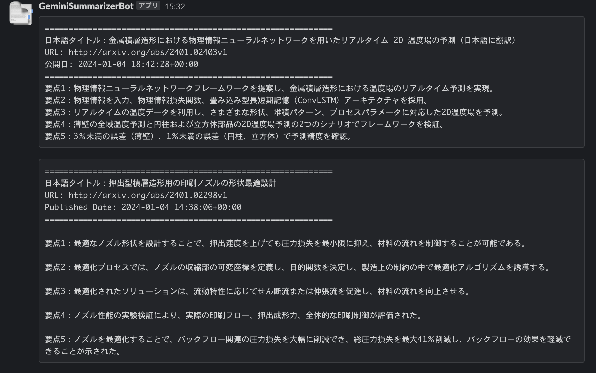

# Gemini と Google Cloud Functions を用いた自動論文収集 & Slack通知ツール

Gemini API は2024年初頭まで無料らしいので使い勝手を見るがてらお試しで作成。

`query=f"{search_terms} AND submittedDate:[{past_date_str} TO {now_str}]"` の形でクエリを作成し、{past_date_str}から{now_str}期間で登録された論文を検索。

論文題目・要旨をGeminiに渡し、要点を5つにまとめて出力されたものをSlackで通知。

Google Cloud Functions 及び Cloud Scheduler を用いて、周期的に実行することで論文をSlackで自動共有できる。

## 使い方

1. SlackのIncoming Webhook URL と Gemini API Key を取得 
2. `summarize_papers(webhook_url, api_key, {search_term})` を実行

## 実行結果

## 参考
https://qiita.com/Hiroaki-K4/items/579014b41adc85fe919f

https://qiita.com/niwasawa/items/90476112dfced169c113
